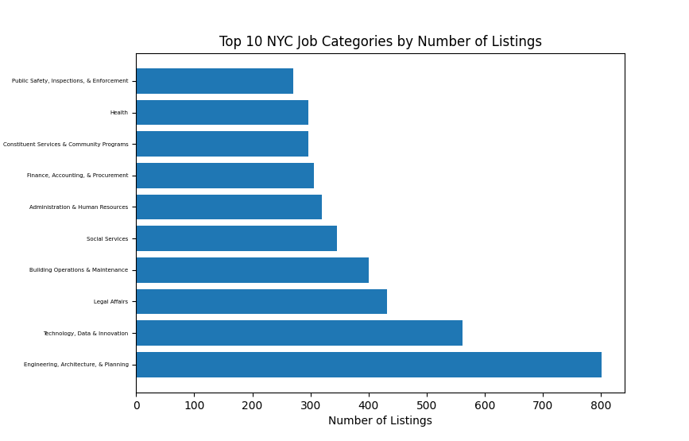
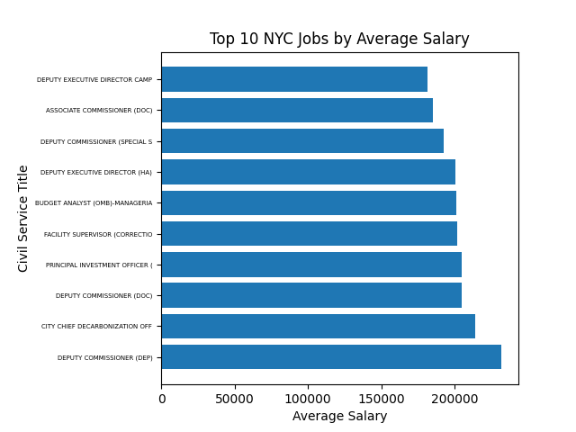

### NYC Job Data Visualization

### Goals:
The primary goal of this project is to visualize 2 relationships.
1. Job category vs. amount of open positions 
2. Civil service title vs. average salary 

# Findings:
### Sample Output Goal 1:

Job Category
Engineering, Architecture, & Planning        801
Technology, Data & Innovation                561
Legal Affairs                                432
Building Operations & Maintenance            400
Social Services                              345
Administration & Human Resources             319
Finance, Accounting, & Procurement           306
Constituent Services & Community Programs    296
Health                                       296
Public Safety, Inspections, & Enforcement    270
---

--- 
### Sample Output Goal 2:

DEPUTY COMMISSIONER (DEP)         231796.0
CITY CHIEF DECARBONIZATION        213783.0
DEPUTY COMMISSIONER (DOC)         205000.0
PRINCIPAL INVESTMENT OFFICER      205000.0
FACILITY SUPERVISOR CORRECTIO     201587.0
BUDGET ANALYST (OMB)-MANAGERIA    201216.6
DEPUTY EXECUTIVE DIRECTOR (HA)    200300.0
DEPUTY COMMISSIONER SPECIAL       192500.0
ASSOCIATE COMMISSIONER (DOC)      185000.0
DEPUTY EXECUTIVE DIRECTOR CAMP    181250.0
--- 

--- 

### Data:
1. Downlaoad the [NYC Job Data ](https://data.cityofnewyork.us/City-Government/NYC-Jobs/kpav-sd4t/explore/query/SELECT%0A%20%20%60job_id%60%2C%0A%20%20%60agency%60%2C%0A%20%20%60posting_type%60%2C%0A%20%20%60number_of_positions%60%2C%0A%20%20%60business_title%60%2C%0A%20%20%60civil_service_title%60%2C%0A%20%20%60title_classification%60%2C%0A%20%20%60title_code_no%60%2C%0A%20%20%60level%60%2C%0A%20%20%60job_category%60%2C%0A%20%20%60full_time_part_time_indicator%60%2C%0A%20%20%60career_level%60%2C%0A%20%20%60salary_range_from%60%2C%0A%20%20%60salary_range_to%60%2C%0A%20%20%60salary_frequency%60%2C%0A%20%20%60work_location%60%2C%0A%20%20%60division_work_unit%60%2C%0A%20%20%60job_description%60%2C%0A%20%20%60minimum_qual_requirements%60%2C%0A%20%20%60preferred_skills%60%2C%0A%20%20%60additional_information%60%2C%0A%20%20%60to_apply%60%2C%0A%20%20%60hours_shift%60%2C%0A%20%20%60work_location_1%60%2C%0A%20%20%60recruitment_contact%60%2C%0A%20%20%60residency_requirement%60%2C%0A%20%20%60posting_date%60%2C%0A%20%20%60post_until%60%2C%0A%20%20%60posting_updated%60%2C%0A%20%20%60process_date%60/page/filter) and save it as 'NYC_Job.csv'
2. `` pip install pandas ``
3. Run:  `` python3 main.py ``
